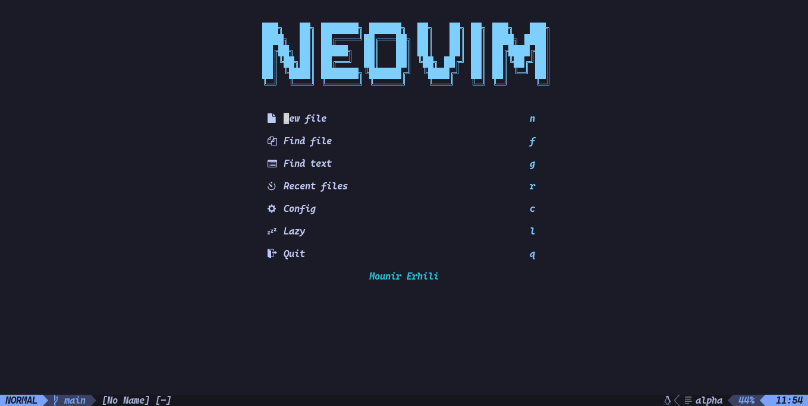
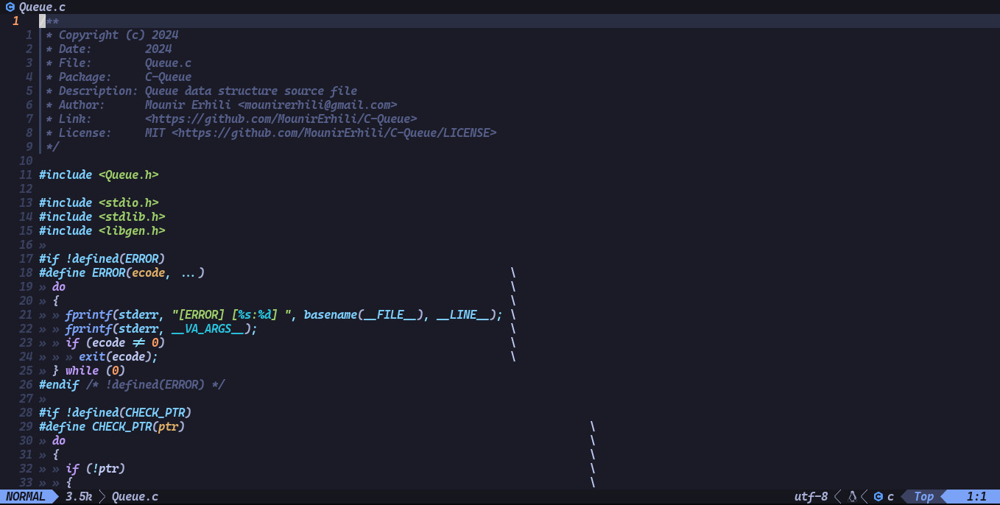
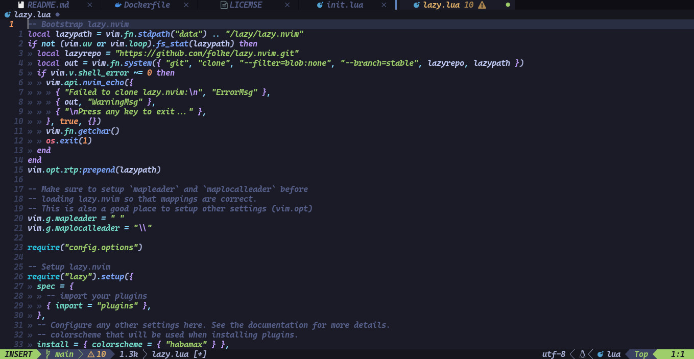
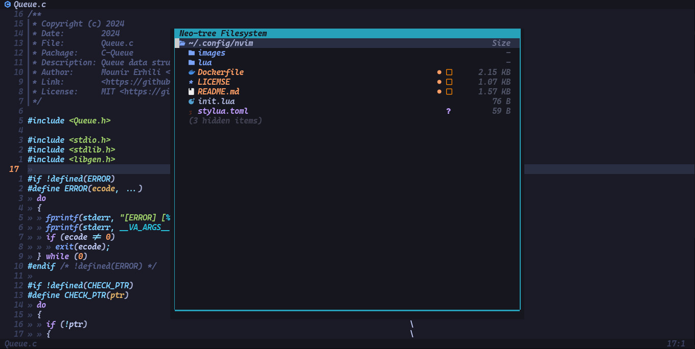

# NeoVim Configuration

<dev align="center">
  <a href="images/neovim-start.jpg">
    
  </a>
  <a href="images/neovim.jpg">
    
  </a>
  <a href="images/neovim-tabs.jpg">
    
  </a>
  <a href="images/neovim-neotree.jpg">
    
  </a>
</dev>

## Requirements

- Neovim >= **0.11.2** (needs to be built with **LuaJIT**)
- Git >= **2.19.0** (for partial clones support)
- a [Nerd Font](https://www.nerdfonts.com/) **_(optional)_**
- a **C** compiler for `nvim-treesitter`. See [here](https://github.com/nvim-treesitter/nvim-treesitter#requirements)

## Getting Started

<details><summary>Void Linux</summary>

- Install requirements for [Void Linux](https://voidlinux.org)

  ```sh
  sudo xbps-install -Sy fd rg git fzf tar 7zip make curl \
    wget bash unzip ninja cmake meson tree-sitter nodejs \
    npm gdb python python-pip gcc neovim
  ```

</details>

- Make a backup of your current Neovim files:

  ```sh
  mv ~/.config/nvim ~/.config/nvim.bak
  mv ~/.local/share/nvim ~/.local/share/nvim.bak
  ```

- Clone the repo

  ```sh
  git clone https://github.com/MounirErhili/nvim ~/.config/nvim
  ```

- Remove the `.git` folder, so you can add it to your own repo later

  ```sh
  cd ~/.config/nvim
  rm -rf .git
  git init && git add .
  ```

- Start Neovim!

  ```sh
  nvim
  ```

## File Structure

You can add your custom plugin specs under `lua/plugins/`. All files there
will be automatically loaded by [lazy.nvim](https://github.com/folke/lazy.nvim)

<pre>
~/.config/nvim
├── lua
│   ├── config
│   │   ├── autocmds.lua
│   │   ├── icons.lua
│   │   ├── keymaps.lua
│   │   ├── lazy.lua
│   │   └── options.lua
│   └── plugins
│       ├── plugin-name.lua
│       ├── ...
└── init.lua
</pre>

